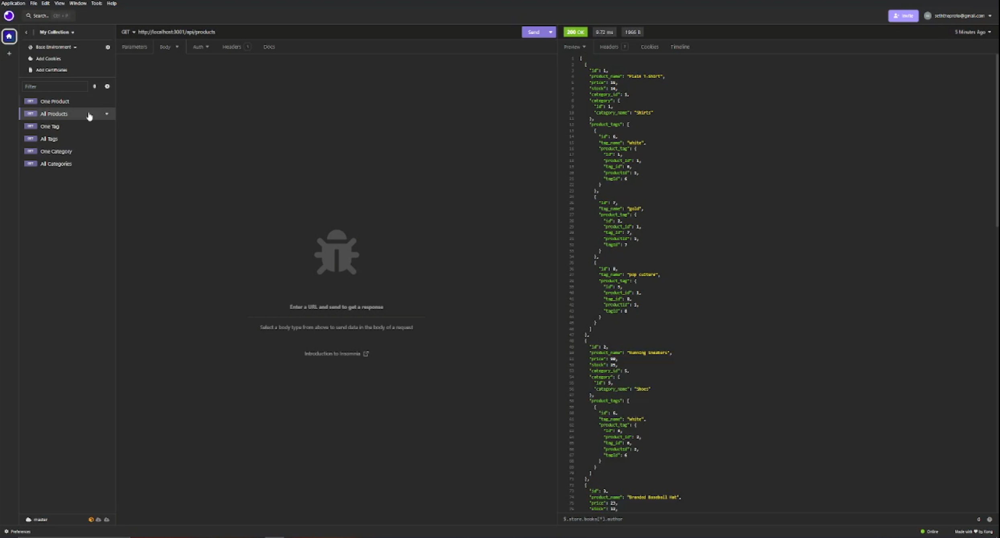

# E-Commerce Back End

## Description

A simple E-Commerce backend demonstration

## Installation

Install Node.JS, Intall MySQL, create a .env file, make the database name "ecommerce_db" (and also create it in SQL terminal), the user "root" and the password your SQL password, and then in your terminal navigate to the project folder and type "npm i -y" followed by "npm start"

## Usage

Call requests using insomnia to various links to the server, such as "http://localhost:3001/api/categories"

## Credits

Coded By: Seth Correa (Seth the Furboi)

## License

Please refer to the LICENSE in the repo.